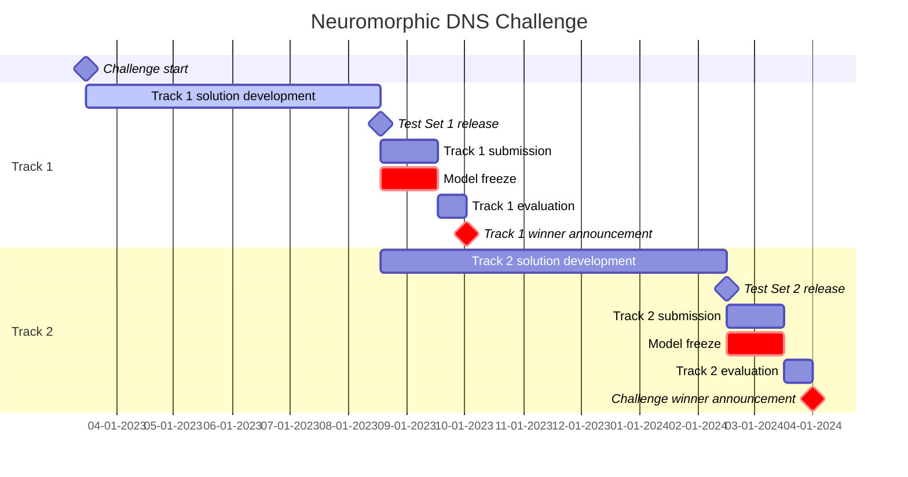

# Readme


The [Intel Neuromorphic Deep Noise Suppression Challenge (Intel N-DNS Challenge)](https://iopscience.iop.org/article/10.1088/2634-4386/ace737) is a contest to help neuromorphic and machine learning researchers create high-quality and low-power real-time audio denoising systems. The Intel N-DNS challenge is inspired by the [Microsoft DNS Challenge](https://github.com/microsoft/DNS-Challenge), and it re-uses the Microsoft DNS Challenge noisy and clean speech datasets. This repository contains the challenge information, code, and documentation to get started with Intel N-DNS Challenge.

A solution to the Intel N-DNS Challenge consists of an audio **encoder**, a **neuromorphic denoiser**, and an audio **decoder**. Noisy speech is input to the encoder, which converts the audio waveform into a form suitable for processing in the neuromorphic denoiser. The neuromorphic denoiser takes this input and removes noise from the signal. Finally, the decoder converts the output of the neuromorphic denoiser into a clean output audio waveform. The Intel N-DNS Challenge consists of two tracks:

**Track 1 (Algorithmic)** aims to encourage algorithmic innovation that leads to a higher denoising performance while being efficient when implemented as a neuromorphic system. The encoder, decoder, and neuromorphic denoiser all run on CPU.

**Track 2 (Loihi 2)** aims to realize the algorithmic innovation in Track 1 on actual neuromorphic hardware and demonstrate a real-time denoising system. The encoder and decoder run on CPU and the neuromorphic denoiser runs on Loihi 2.

Solutions submitted to the Intel N-DNS challenge are evaluated in terms of an audio quality metric (denoising task performance) and computational resource usage metrics, which measure the efficiency of the solution as a system; submissions also include source code and a short write-up. Solutions will be holistically considered (metrics, write-up, innovativeness, commercial relevance, etc.) by an Intel committee for a monetary prize (details below).

Please see our [paper in Neuromorphic Computing and Engineering](https://iopscience.iop.org/article/10.1088/2634-4386/ace737) ([also on arXiv](https://arxiv.org/abs/2303.09503)) for a more detailed overview of the challenge.

## Table of Contents
* [How to participate?](https://github.com/IntelLabs/IntelNeuromorphicDNSChallenge#how-to-participate)
* [Install instructions](https://github.com/IntelLabs/IntelNeuromorphicDNSChallenge#install-instructions)
* [Dataset](https://github.com/IntelLabs/IntelNeuromorphicDNSChallenge#dataset)
* [Dataloader](https://github.com/IntelLabs/IntelNeuromorphicDNSChallenge#dataloader)
* [Baseline Solution](https://github.com/IntelLabs/IntelNeuromorphicDNSChallenge#baseline-solution)
* [Evaluation Metrics](https://github.com/IntelLabs/IntelNeuromorphicDNSChallenge#evaluation-metrics)
* [Metricsboard](https://github.com/IntelLabs/IntelNeuromorphicDNSChallenge#metricsboard)
* [Challenge Rules](Intel_NDNS_Challenge_Rules.pdf)

## How to participate?

Follow the [registration instructions](https://github.com/IntelLabs/IntelNeuromorphicDNSChallenge#1-registration) below to participate. The overview of the challenge timeline is shown below.



### Important dates

|Phase|Date|
|-|-:|
|Challenge start             | Mar 16, 2023|
|Test set 1 release          | _On or about_ Aug 18, 2023|
|Track 1 submission deadline | _On or about_ Sep 18, 2023|
|Track 1 winner announcement | Oct 2, 2023|
|Test set 2 release          | _On or about_ Jan 28, 2024|
|Track 2 submission deadline | _On or about_ Feb 28, 2024|
|Track 2 winner announcement | Mar 14, 2024|
> Challenge dates are subject to change. Registered participants shall be notified of any changes in the dates or fixation of _on or about_ dates.


### 1. Registration
1. Create your challenge github repo (public or private) and provide access to `lava-nc-user` user.
2. Register for the challenge [here](https://intel.az1.qualtrics.com/jfe/form/SV_agZwvhRHlMw1y86).
3. You will receive a registration confirmation.

Once registered, you will receive updates about different phases of the challenges.

> Participation for Track 2 will need Loihi system cloud access which needs an Intel Neuromorphic Research Collaboration agreement. Please see [Join the INRC](https://intel-ncl.atlassian.net/wiki/spaces/INRC/pages/1784807425/Join+the+INRC) or drop an email to [inrc_interest@intel.com](mailto:inrc_interest@intel.comm). This process might take a while, so it is recommended to initiate this process as early as possible if you want to participate in Track 2.

### 2. Test Set 1 Release
The test set for Track 1 has been released, and we are currently in the _Track 1 model freeze phase_. The details on test set 1 can be found [here](https://github.com/IntelLabs/IntelNeuromorphicDNSChallenge#4-testing-data).
* Participants shall not change their model during this phase.
* Participants shall evaluate their model on _test set 1_, measure all the necessary metrics on an Intel Core i5 quad-core machine clocked at 2.4 GHz or weaker, and submit their metrics to the test set metricsboard, along with a solution writeup.

> __Important:__ At least one validation metricsboard entry must have been submitted before the _Track 1 model freeze phase_. Metricboard entries will be randomly verified.

### 3. Track 1 Winner
A committee of Intel employees evaluated the Track 1 solutions considering audio quality, computational resource usage, solution write-up quality, innovativeness, and commercial relevance. __Team Clairaudience__ was declared __the winner of Track 1 of the challenge__. To find out more about the winning solution, watch the talk from the winning team [here](https://intel-ncl.atlassian.net/wiki/spaces/INRC/blog/2023/12/01/2027225099/INRC+Forum+12+12+2023.+Clairaudience+Intel+N-DNS+Challenge+Track+1+Algorithmic+Winner.) and the implementation [github repo](https://github.com/haoxiangsnr/spiking-fullsubnet).

<p align="center">

</p>
<p align="center">Team Clairaudience: Track 1 Winner</p>


> __Important:__ Intel reserves the right to consider and evaluate submissions at its discretion. Implementation and management of this challenge and associated prizes are subject to change at any time without notice to contest participants or winners and is at the complete discretion of Intel.

### 4. Test set 2 Release
Once the _test set 2_ for Track 2 is released, we will enter _Track 2 model freeze phase_. The details on test set 2 will be updated later.
* Participants shall not change their model during this phase.
* Participants shall evaluate their model on _test set 2_, measure all the necessary metrics on Loihi, and submit their metrics along with a solution writeup.

> __Important:__ At least one valid metric board entry must have been submitted before _Track 2 model freeze phase_. Metricboard entries will be randomly verified.

### 5. Track 2 Winner (Challenge Winner)
A committee of Intel employees will evaluate the Track 2 solutions to decide the winners, making a holistic evaluation including audio quality, computational resource usage, solution write-up quality, innovativeness, and commercial relevance.

> __Important:__ Intel reserves the right to consider and evaluate submissions at its discretion. Implementation and management of this challenge and associated prizes are subject to change at any time without notice to contest participants or winners and is at the complete discretion of Intel.


### Prize
There will be two prizes awarded
* __Track 1 winner__: fifteen thousand dollars (US \$15,000.00) or the equivalent in grant money to the winner of Track 1

and six months later,
* __Track 2 winner__: forty thousand dollars (US \$40,000.00) or the equivalent in grant money to the winner of Track 2.

These awards will be made based on the judging of the Intel committee. Where the winner is a resident from one of the named countries in the Intel N-DNS Challenge Rules and not a government employee, Intel can directly award the prize money to the winner. Where the winner is a government employee to which Intel can administer academic grant funding (regardless of whether the winner resides in one of the named countries in the Intel N-DNS Challenge Rules); a research grant in the amount for the appropriate track will be awarded to the university where the researcher/government employee is from, and in the researcher's name. Where the winner does not fall into the above categories, Intel will publicly recognize the winner, but the winner is not eligible to receive a prize. Limit of one prize per submission. 

> **Important**:
> * Researchers affiliated with universities worldwide, not restricted to the countries listed in the N-DNS Challenge Rules, are also eligible to receive prizes that Intel will administer. This includes, but is not limited to, government employees such as professors, research associates, postdoctoral research fellows, and research scientists employed by a state-funded university or research institution. Where possible, Intel will provide unrestricted gift funding to the awardee's department or group. However, universities in countries under U.S. embargo are not eligible to receive award funding.
> * Other individuals that do not fall into the above categories, but wish to enter this Contest, may do so. However, they are not eligible for any prize, but will be publicly recognized if they win. See Prizes under N-DNS Challenge Rules for further details. 
> * For avoidance of doubt, Intel has the sole discretion to determine the category of the entries to the N-DNS Award contest.

### Solution Writeup
We also ask that challenge participants submit a short (one or two page) write-up that explains the thought process that went into developing their solution. Please include:

- What worked, what did not work, and why certain strategies were chosen versus others. While audio quality and power are key metrics for evaluating solutions, the overarching goal of this challenge is to drive neuromorphic algorithm innovation, and challenge participant learnings are extremely valuable.
- A clear table with the test set 1 evaluation metrics for your solution akin to the Table in the [Metricsboard](https://github.com/IntelLabs/IntelNeuromorphicDNSChallenge#metricsboard).
- Brief instructions for how to train your model and run test set inference. (E.g., path to a training & inference script in your Github repository)
- Brief instructions on how to run inference in Lava for your model. (E.g., path to an example python notebook with a basic Lava process diagram like [baseline_solution/sdnn_delays/lava_inference.ipynb](https://github.com/IntelLabs/IntelNeuromorphicDNSChallenge/blob/main/baseline_solution/sdnn_delays/lava_inference.ipynb)

For your writeup, please use a single-column Word document or Latex template with 1-inch margins, single-spacing, reasonable font size (11pt or 12pt; default font like Times New Roman), and up to two US letter-size or A4 pages. Please submit a PDF. Please upload your writeup PDF to the top level of your Github repository with filename ```writeup.pdf```. 

Please note that each team submits a single write-up. If a team is submitting multiple models to the Metricsboard, a single write-up should describe all models from that team. This write-up can be submitted directly to Intel to maintain privacy before the track deadline, but for the write-up to be considered in the holistic evaluation of the solution for the monetary prize, we require that it be shared publicly within 14 days after the test set evaluation deadline for each track. Naturally, however, we encourage participants to share their write-ups publicly at any time, to help inspire others' solutions.

Additionally, we plan to invite a select group of challenge participants to present their solutions at a future Intel Neuromorphic Research Community (INRC) forum, based on their algorithmic innovation and metricsboard results as judged by the Intel committee, to share their learnings and participate in a discussion on developing new and improved neuromorphic computing challenges.


### Source code
Challenge participants must provide the source code used in the creation of their solution (model definition, final trained model, training scripts, inference scripts, etc.) with MIT or BSD3 license.

Challenge participant source code for Track 1 will be publicly released after the Track 1 winner is announced. Likewise for Track 2.

## Install Instructions
```bash
pip install -r requirements.txt
python -c "import os; from distutils.sysconfig import get_python_lib; open(get_python_lib() + os.sep + 'ndns.pth', 'a').write(os.getcwd())"
```

## Uninstall Instructions
```bash
python -c "import os; from distutils.sysconfig import get_python_lib; pth = get_python_lib() + os.sep + 'ndns.pth'; os.remove(pth) if os.path.exists(pth) else None;"
```

## Dataset

### 1. Download steps
- Edit `microsoft_dns/download-dns-challenge-4.sh` to point the desired download location and downloader
- `bash microsoft_dns/download-dns-challenge-4.sh`
- Extract all the `*.tar.bz2` files.

### 2. Download verification
- Download SHA2 [checksums](https://dns4public.blob.core.windows.net/dns4archive/dns4-datasets-files-sha1.csv.bz2) and extract it.
- Run the following to verify dataset validity.
    ```python
    import pandas as pd
    import hashlib

    def sha1_hash(file_name: str) -> str:
        file_hash = hashlib.sha1()
        with open(file_name, 'rb') as f: fb = f.read()
        file_hash.update(fb)
        return file_hash.hexdigest()

    sha1sums = pd.read_csv("dns4-datasets-files-sha1.csv.bz2", names=["size", "sha1", "path"])
    file_not_found = []
    for idx in range(len(sha1sums)):
        try:
            if sha1_hash(sha1sums['path'][idx]) != sha1sums['sha1'][idx]:
                print(sha1sums['path'][idx], 'is corrupted')
        except FileNotFoundError as e:
            file_not_found.append(sha1sums['path'][idx])

    # 336494 files
    with open('missing.log', 'wt') as f:
        f.write('\n'.join(file_not_found))
    ```

### 3. Training/Validation data synthesization
- Training dataset: `python noisyspeech_synthesizer.py -root <your dataset folder>`
- Validation dataset: `python noisyspeech_synthesizer.py -root <your dataset folder> -is_validation_set true`

### 4. Testing data
- __Testing dataset for track 1__ can be downloaded by executing the download script `./test_set_1/download.sh`
    - > __Note:__ The test set download makes use of git large file system (GIT LFS). Make sure you have installed git-lfs `git lfs install`
    - The download script will printout further commands to
        1. verify the dataset files and 
        2. extract the audio data. The default extraction folder is `data/MicrosoftDNS_4_ICASSP/test_set_1/`
- Testing data with similar statistics as the validation dataset generated from the script above will be made available towards the end of each track 2 as well.

## Dataloader
```python
from audio_dataloader import DNSAudio

train_set = DNSAudio(root=<your dataset folder> + 'training_set/')
validation_set = DNSAudio(root=<your dataset folder> + 'validation_set/')
test_set_1 = DNSAudio(root=<your dataset folder> + 'test_set_1/')
```

## Baseline Solution

The baseline solution is described in the [Intel N-DNS Challenge paper](https://iopscience.iop.org/article/10.1088/2634-4386/ace737). 

The code for training and running the baseline solution can be found in this directory: `baseline_solution/sdnn_delays`. 

The training script `baseline_solution/sdnn_delays/train_sdnn.py` is run as follows:
```bash
python train_sdnn.py # + optional arguments
```

## Evaluation Metrics

The N-DNS solution will be evaluated based on multiple different metrics.
1. **SI-SNR** of the solution
2. **SI-SNRi** of the solution (improvement against both _noisy data_ and _encode+decode_ processing).
1. **DNSMOS** quality of the solution (overall, signal, background)
3. **Latency** of the solution (encode & decode latency + data buffer latency +  DNS network latency)
4. **Power** of the N-DNS network (proxy for Track 1)
5. **Power Delay Product (PDP)** of the N-DNS solution (proxy for Track 1)

### SI-SNR
This repo provides SI-SNR module which can be used to evaluate SI-SNR and SI-SNRi metrics.

$\displaystyle\text{SI-SNR} = 10\ \log_{10}\frac{\Vert s_\text{target}\Vert ^2}{\Vert e_\text{noise}\Vert ^2}$

>where\
$s = \text{zero mean target signal}$\
$\hat{s} = \text{zero mean estimate signal}$\
$s_\text{target} = \displaystyle\frac{\langle\hat s, s\rangle\,s}{\Vert s \Vert ^2}$\
$e_\text{noise} = \hat s - s_\text{target}$

- **In Code Evaluation**
    ```python
    from snr import si_snr
    score = si_snr(clean, noisy)
    ```

### DNSMOS (MOS)
This repo provides DNSMOS module which is wrapped from Microsoft DNS challenge. The resulting array is a DNSMOS score (overall, signal, noisy). It also supports batched evaluation.
- **In Code Evaluation**
    ```python
    from dnsmos import DNSMOS
    dnsmos = DNSMOS()
    quality = dnsmos(noisy)  # It is in order [ovrl, sig, bak]
    ```


Other metrics are specific to the N-DNS solution system. For reference, a detailed walkthrough of the evaluation of the baseline solution is described in [`baseline_solution/sdnn_delays/evaluate_network.ipynb`](https://github.com/IntelLabs/IntelNeuromorphicDNSChallenge/blob/main/baseline_solution/sdnn_delays/evaluate_network.ipynb).

Please refer to the [Intel N-DNS Challenge paper](https://iopscience.iop.org/article/10.1088/2634-4386/ace737) for more details about the metrics.

## Metricsboard
The evaluation metrics for participant solutions will be listed below and updated at regular intervals.

Submitting to the metricsboard will help you meaure the progress of your solution against other participating teams. Earlier submissions are encouraged.

To submit to the metricsboard, please create a ```.yml``` file with contents akin to the table below in the top level of the Github repository that you share with Intel so that we can import your metrics and update them on the public metricsboard. Please use [```example_metricsboard_writeout.py```](https://github.com/IntelLabs/IntelNeuromorphicDNSChallenge/blob/main/example_metricsboard_writeout.py) as an example for how to generate a valid ```.yml``` file with standard key names. For the Track 1 validation set, name the ```.yml``` file ```metricsboard_track_1_validation.yml```. For Track 1 test set, name the ```.yml``` file ```metricsboard_track_1_test.yml```.


**Track 1 final results (Test Set 1)**
| Entry| <sub>$\text{SI-SNR}$ <sup>(dB)| <sub>$\text{SI-SNRi}$ <sup>data (dB)| <sub>$\text{SI-SNRi}$ <sup>enc+dec (dB)| <sub>$\text{MOS}$ <sup>(ovrl)| <sub>$\text{MOS}$ <sup>(sig)| <sub>$\text{MOS}$ <sup>(bak)| <sub>$\text{latency}$ <sup>enc+dec (ms)| <sub>$\text{latency}$ <sup>total (ms)| <sub>$\text{Power}$ $\text{proxy}$ <sup>(M-Ops/s) | <sub>$\text{PDP}$ $\text{proxy}$ <sup>(M-Ops)| <sub>$\text{Params}$ <sup>($\times 10^3$)|<sub>$\text{Size}$ <sup>(KB)|
|:-:|-:|-:|-:|-:|-:|-:|-:|-:|-:|-:|-:|-:|
| <td colspan=12> [Team Clairaudience](https://github.com/haoxiangsnr/spiking-fullsubnet) 🥇🥇🥇**Track 1 Winner**🏆🏆🏆 |
| Clairaudience (model_L 2023-07-27)  | 14.80 | 7.43 | 7.43 | 3.03 | 3.33 | 3.96 | 0.03 | 32.03 | 74.10 | 2.37 | 1,289.00 | 5,156.00 |
| Clairaudience (model_M 2023-07-26)  | 14.71 | 7.34 | 7.34 | 3.05 | 3.35 | 3.97 | 0.03 | 32.03 | 53.60 | 1.72 | 954.00 | 3,816.00 |
| Clairaudience (model_S 2023-07-25)  | 13.89 | 6.52 | 6.52 | 2.97 | 3.28 | 3.93 | 0.03 | 32.03 | 29.24 | 0.94 | 521.00 | 2,084.00 |
| Clairaudience (model_XL 2023-07-27)  | 15.20 | 7.83 | 7.83 | 3.07 | 3.37 | 3.99 | 0.03 | 32.03 | 55.91 | 1.79 | 1,798.00 | 7,192.00 |
|<td colspan=12> [Team XTeam](https://github.com/wangtianrui/XTeam) 🥈🥈**Track 1 Runner Up**|
| XTeam (CTDNN_LAVADL 2023-09-15)  | 13.52 | 6.59 | 6.59 | 2.97 | 3.32 | 3.86 | 0.00 | 32.00 | 61.37 | 0.49 | 904.80 | 3,619.18 |
| XTeam (XNN 2023-09-15)  | 10.75 | 3.82 | 3.82 | 2.73 | 3.20 | 3.50 | 0.00 | 32.00 | 82.08 | 0.66 | 3,676.17 | 14,704.00 |
| <td colspan=12> [Team SPANDEX](https://github.com/Michaeljurado42/SPANDEX) 🥉**Track 1 Honorable Mention**|
| SPANDEX (50% Sparsity SDNN 2023-08-18)  | 12.16 | 4.80 | 4.80 | 2.70 | 3.19 | 3.46 | 0.01 | 32.01 | 9.32 | 0.30 | 344.00 | 305.00 |
| SPANDEX (75% Sparsity SDNN 2023-08-18)  | 11.72 | 4.36 | 4.36 | 2.68 | 3.24 | 3.29 | 0.01 | 32.01 | 6.06 | 0.19 | 174.00 | 154.00 |
| <td colspan=12> [Team NECOTIS](https://github.com/NECOTIS/IntelNeuromorphicDNSChallenge)|
| NECOTIS (PSNN - K3 2023-08-03)  | 12.32 | 4.96 | 4.96 | 2.68 | 2.91 | 3.96 | 0.00 | 32.00 | 57.24 | 1.83 | 723.71 | 2,827.00 |
| NECOTIS (PSNN 2023-07-27)  | 13.65 | 6.26 | 6.26 | 2.67 | 2.92 | 3.93 | 0.00 | 32.00 | 105.17 | 3.37 | 1,512.19 | 5,907.00 |
| NECOTIS (SRNN-256 2023-07-27)  | 10.83 | 3.46 | 3.46 | 2.78 | 3.18 | 3.75 | 0.00 | 32.00 | 18.57 | 0.59 | 459.78 | 1,796.00 |
| <td colspan=12> [Team NoiCE](https://github.com/thebarnable/noice)|
| NoiCE (Spiking Conv 2023-09-18)  | 12.96 | 5.60 | 5.60 | 2.79 | 3.22 | 3.64 | 0.05 | 32.05 | 6,110.76 | 195.87 | 2,100.22 | 8,209.00 |
| <td colspan=12> [Team Phase3 Physics](https://github.com/phase3physics/INDNS)|
| Phase 3 Physics (Conv SDNN solution, 21 training epochs 2023-09-18)  | 12.59 | 5.22 | 5.22 | 2.74 | 3.18 | 3.59 | 0.01 | 32.01 | 51.20 | 1.64 | 497.00 | 1,900.00 |
|<td colspan=12> [Team Siliron](https://github.com/zhe-ch/Siliron)|
| Siliron (ARG-ABS SDNN solution 2023-09-16)  | 9.05 | 1.69 | 1.69 | 2.55 | 3.22 | 2.94 | 0.02 | 8.02 | 1.16 | 0.01 | 33.00 | 77.20 |
|<td colspan=12> __Baselines__|
| Microsoft NsNet2 (02/20/2023)      | 11.63 | 4.26 | 4.26 | 2.95 | 3.26 | 3.93 | 0.024 | 20.024 | 136.13 | 2.72 | 2,681 | 10,500 |
| Intel proprietary DNS (02/28/2023) | 12.51 | 5.14 | 5.14 | 3.08 | 3.34 | 4.07 | 0.015 | 32.015 |    -   |   -  | 1,901 | 3,802|
| Baseline SDNN solution (02/20/2023)| 12.26 | 4.89 | 4.89 | 2.70 | 3.20 | 3.45 | 0.015 | 32.015 |  14.52 | 0.46 |   525 |   465|
| Test Set 1                         |  7.37 |   -  |   -  | 2.43 | 3.16 | 2.69 |   -   |    -   |    -   |   -  |   -   |   -  |

> **Note:** Track 1 validation metricsboard can be found [here](track1_val_metricsboard.md).

**Track 2**
| Entry| <sub>$\text{SI-SNR}$ <sup>(dB)| <sub>$\text{SI-SNRi}$ <sup>data (dB)| <sub>$\text{SI-SNRi}$ <sup>enc+dec (dB)| <sub>$\text{MOS}$ <sup>(ovrl)| <sub>$\text{MOS}$ <sup>(sig)| <sub>$\text{MOS}$ <sup>(bak)| <sub>$\text{latency}$ <sup>enc+dec (ms)| <sub>$\text{latency}$ <sup>total (ms)| <sub>$\text{Power}$ <sup>(W) | <sub>$\text{PDP}$ <sup>(Ws)| <sub>$\text{Cores}$|
|:-:|-:|-:|-:|-:|-:|-:|-:|-:|-:|-:|-:|
| Team xyz (mm/dd/yyyy) |        |         |         |         |             |           |   | | | | |

> **Note:**
> * An Intel committee will determine the challenge winner using a holistic evaluation (not one particular metric). We encourage challenge participants to strive for top performance in all metrics. 
> * Metrics shall be taken as submitted by the participants. There will be a verification process during the contest winner evaluation.


For any additional clarifications, please refer to the challenge [FAQ](faq.md) or [Rules](Intel_NDNS_Challenge_Rules.pdf) or ask questions in the [discussions](https://github.com/IntelLabs/IntelNeuromorphicDNSChallenge/discussions) or email us at [ndns@intel.com](mailto:ndns@intel.com).

